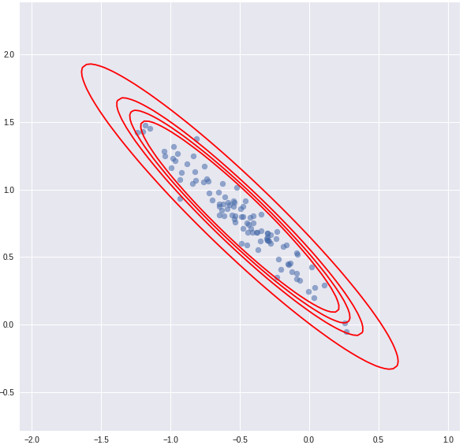

# Parametric Models

This package provides a simple way to estimate parametric statistical models given by functional equation. The author was inspired by well-known theory of M-estimation.

In addition to model estimation, there are functions that simulate and fit data. This can be useful for assessing the quality of theoretical asymptotic confidence regions, or study effects in misspecified models.

The implementation is based on low-level tensorflow 2.0 functional API


## Quick start
This demo follows closely an example from the .ipynb notebook included in the repository.

After installing a package and importing necessary functionality from `utils` and `classes` modules, one can define a parametric model in a few code blocks:

1. Define the functional form (e.g. linear model)


```python
@tf.function
def linear_equation(input_features, params):
    return tf.squeeze(tf.matmul(input_features, params['W']))+ params['b']
```

2. Define the process generating data

```python
def linear_gaussian_simulation_scheme(X_mean, X_cov, params, y_ssq):
    def concrete_linear_simulation_scheme(num_samples):
        X_sim = np.random.multivariate_normal(mean = X_mean, cov = X_cov, size = num_samples).astype(np.float32)
        err = np.random.normal(loc = 0., size = num_samples, scale = np.sqrt(y_ssq)).astype(np.float32)
        y_sim = linear_equation(X_sim, params) + err

        return tf.Variable(X_sim) , y_sim
    return concrete_linear_simulation_scheme

# future model weights
W0 = tf.Variable([[-.5],[.8]], dtype = tf.float32)
b0 = tf.Variable(1.0, dtype = tf.float32)
linear_params0 = OrderedDict({'W': W0, 'b': b0})
```

3. Define the model and assign a simulation scheme

```python
mc = ModelFromConcreteFunction(linear_equation, model_name = "ols_linear", params = linear_params0) # params keys must be compatible with linear equation

X_cov = np.array([[1,.95], [.95,1]], dtype = np.float32)
mc.simulation_scheme = linear_gaussian_simulation_scheme(
    np.array([0., 0.], dtype = np.float32),
    X_cov,
    linear_params0,
    y_ssq = 9.
    )
```

4. Generate data and fit the model

```python
num_samples = 1000
tmp_x, tmp_y = mc.simulation_scheme(num_samples)

mc.fit(
    tmp_x, tmp_y
    , num_steps = tf.Variable(1000)
    , loss = sq_loss
    , params = linear_params0 # initial quess
    , optimizer = tf.keras.optimizers.Adam(learning_rate = 1e-2)
    )

```

5. Fit multiple models independently with a specified simulation scheme

```python
num_samples = 1000

res = mc.fit_simulated_experiments(num_samples = num_samples
    , num_experiments = 100
    , num_steps = tf.Variable(2000)
    , params = linear_params0
    , loss = sq_loss
    , optimizer = tf.keras.optimizers.Adam(learning_rate = 1e-2)
    )
```

6. Plot results of estimations across experiments

```python
cov_est = mc.parameter_covariance_plug_in_estimator(tmp_x, tmp_y, linear_params0, loss = sq_loss)

m = ravel_dicts([linear_params0])
proj = np.eye(3,2)

plot_confidence_2d_projection(m.reshape(-1,1), cov_est, proj, ravel_dicts(res))
```



## Examples

The repository includes an .ipynb notebook with several simple examples:
1. Ordinary Least Squares estimation of linear model
2. Weighted Least Squares estimation of linear model
3. Ordinary Least Squares estimation with nonlinear functional form
4. Log-likelihood estimation of homoskedastic linear model
5. Log-likelihood estimation of heteroskedastic linear model

## References
1. van der Vaart, A. W. (1998). Asymptotic Statistics, Cambridge University Press
2. Stefanski, L., and Boos, D. (2002). The Calculus of M-Estimation. The American Statistician
